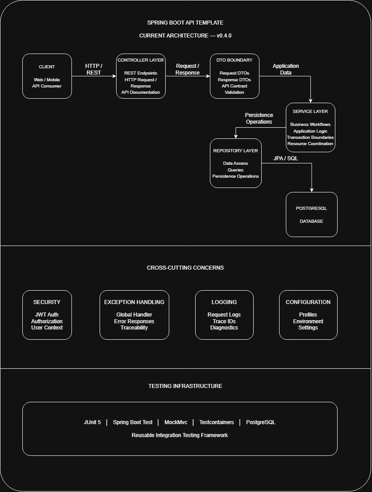

# Architecture Overview

## Current State

The Spring Boot API Template currently follows a **layered architecture** designed to provide a maintainable, testable, and reusable foundation for Spring Boot REST API development.

The primary request flow is:

```text
Controller → DTO Boundary → Service → Repository → Database
```

This structure provides clear separation between API concerns, application workflows, persistence operations, and shared technical concerns.

The repository also includes cross-cutting components for:

* Security
* Exception handling
* Logging
* Configuration
* Testing infrastructure
* API documentation
* CI and containerized development

The architecture is intentionally practical rather than overly complex. It provides clear boundaries while keeping the template approachable for developers who need a solid starting point for building REST APIs.

---

# Current Architecture

The current implementation is represented by the following architecture diagram:



The editable source for the diagram is available at:

```text
docs/diagrams/Architecture.drawio
```

The primary application flow is:

```text
Controller
    ↓
DTO Boundary
    ↓
Service
    ↓
Repository
    ↓
Database
```

The components surrounding this flow provide supporting capabilities across the application.

---

# Current Layer Responsibilities

## API Layer

The API layer is responsible for handling HTTP requests and responses at the application boundary.

Responsibilities include:

* Handling HTTP requests and responses
* Request validation
* API contract management
* Mapping requests and responses through DTOs
* OpenAPI documentation

Examples include:

* `VehicleController`
* `MaintenanceController`
* `AuthController`

---

## DTO Boundary

DTOs define the external API contract and provide separation between API models and persistence entities.

Responsibilities include:

* Defining request and response structures
* Preventing direct exposure of persistence entities
* Controlling data exchanged through the API
* Allowing API contracts to evolve independently from persistence models

Examples include:

* `VehicleRequestDTO`
* `VehicleResponseDTO`
* `MaintenanceRequestDTO`
* `MaintenanceResponseDTO`

This boundary reduces coupling between API consumers and internal persistence implementation details.

---

## Service Layer

The service layer contains application workflows and coordinates operations between the API boundary and persistence layer.

Responsibilities include:

* Application and business workflows
* Coordination between repositories and models
* Resource validation
* Transaction boundaries
* Application-level business rules

Examples include:

* `VehicleService`
* `MaintenanceService`
* `AuthenticationService`

---

## Persistence Layer

The persistence layer is responsible for database access and persistence operations.

Responsibilities include:

* Database access
* Entity persistence
* Query operations
* Interaction with the underlying database

Examples include:

* `VehicleRepository`
* `MaintenanceRepository`
* `UserRepository`

The persistence layer is implemented using Spring Data JPA and PostgreSQL.

---

# Cross-Cutting Concerns

The application separates shared technical concerns that support the primary application flow.

## Security

Security provides authentication and authorization capabilities across protected API resources.

Responsibilities include:

* JWT authentication
* Authorization checks
* User context handling
* Authentication failure handling
* Integration with the Spring Security context

Examples include:

* `JwtAuthFilter`
* `JwtService`
* `CustomUserDetails`
* `CurrentUserService`
* `RestAuthenticationEntryPoint`

JWT processing is isolated within the security layer so that application services do not need to manage token parsing or HTTP authentication concerns directly.

---

## Exception Handling

Exception handling provides consistent error processing across the application.

Responsibilities include:

* Centralized exception management
* Consistent API error responses
* Validation error handling
* Traceability

Examples include:

* `GlobalExceptionHandler`
* `ErrorResponse`

---

## Logging

Logging provides application and request visibility for troubleshooting and operational diagnostics.

The application uses structured request logging with trace identifiers to support debugging and request traceability.

Sensitive information such as passwords and JWT tokens is intentionally excluded from application logs.

---

## Configuration

Configuration centralizes environment-specific and application-level settings.

This allows the same application to be configured for different environments without coupling the application code to a specific deployment environment.

Environment-specific configuration is managed through Spring profiles and environment variables.

---

## API Documentation

OpenAPI documentation provides an interactive description of the API contract.

Swagger UI allows developers to:

* Browse available endpoints
* Review request and response models
* Authenticate using JWT bearer tokens
* Execute API requests during development

API documentation is maintained alongside the controllers and API contracts.

---

## CI and Containerization

The repository includes supporting infrastructure for consistent development and automated verification.

### CI

GitHub Actions automatically builds and tests the application on pushes and pull requests to the configured branches.

The CI pipeline verifies that the application continues to compile and that the automated test suite passes.

### Containerization

Docker and Docker Compose provide a repeatable local environment for the application and PostgreSQL database.

This allows developers to start the application and its database dependencies without requiring a manually configured PostgreSQL environment.

These capabilities support the application architecture but remain separate from the application business layers.

---

# Testing Architecture

Testing is treated as part of the template architecture rather than as an afterthought.

The template includes both unit and integration testing infrastructure.

Testing uses:

* JUnit 5
* Spring Boot Test
* Mockito
* MockMvc
* Testcontainers
* PostgreSQL
* JaCoCo

## Unit Testing

Unit tests provide focused verification of application components without requiring the full application context or database.

Current testing examples include:

* Service-layer testing
* Security component testing
* JWT processing
* Current-user resolution
* Controller testing

The tests follow a consistent **Arrange / Act / Assert** structure where appropriate.

## Integration Testing

Integration testing uses PostgreSQL Testcontainers and Spring Boot's integration testing infrastructure.

The integration testing framework provides:

* Isolated database testing environments
* HTTP-level API validation
* Authentication workflow testing
* Resource lifecycle testing
* Database cleanup between tests
* Reusable testing patterns for additional resources

Integration tests use shared testing infrastructure and helpers to provide consistent patterns for additional resources.

## Code Coverage

JaCoCo is used to generate code coverage reports for the test suite.

Coverage reporting is intended to provide visibility into tested application behavior and identify areas where additional testing may provide value.

Coverage percentages are treated as a quality indicator rather than a target that drives unnecessary test implementation.

---

# Validation Strategy

Validation currently occurs at multiple levels.

## API Boundary Validation

Jakarta Validation is used for structural validation at the API boundary.

Examples include:

* Required fields
* String length limits
* Input formatting
* Request structure validation

---

## Application Validation

Application-level validation is performed within service workflows where rules depend on application state or relationships.

Examples include:

* Duplicate resource checks
* Resource existence checks
* Relationship validation
* Business workflow constraints

As the architecture evolves, appropriate business rules may move into more explicit domain models or use cases.

---

# Example Domain Entities

The repository includes example business entities used to demonstrate how the template can be extended.

These examples are intentionally included as **reference implementations** rather than as required application domains. Developers using the template can replace or remove them when building their own applications.

Current example entities primarily represent persistence models mapped to database tables.

## Vehicle Example

The Vehicle example demonstrates a typical resource with:

* Resource identification
* Operational details
* Lifecycle information
* Domain-specific attributes

It demonstrates the interaction between controllers, DTOs, services, repositories, and persistence.

## MaintenanceRecord Example

The MaintenanceRecord example demonstrates a related resource containing:

* Maintenance details
* Resource relationships
* Operational records

These examples provide concrete implementations of the template's current architectural patterns.

---

# Future Architecture Direction

The current layered architecture provides a practical foundation for applications of moderate complexity.

As an application grows, future iterations may adopt stronger **Clean Architecture and domain-centric patterns** where those patterns provide meaningful benefits.

Potential future improvements include:

* Stronger separation between business rules and infrastructure concerns
* Increased independence from framework-specific implementations
* Explicit application use cases
* Richer domain models
* Additional domain-driven patterns
* More explicit boundaries between application and infrastructure concerns

A potential future structure could resemble:

```text
src/main/java/

├── domain/
│   ├── model/
│   ├── repository/
│   ├── service/
│   └── usecase/

├── application/
│   └── DTOs, orchestration, input/output models

├── infrastructure/
│   ├── persistence/
│   ├── web/
│   ├── external/
│   └── config/

├── common/
│   └── shared utilities, exceptions, constants

└── Application.java
```

This structure represents a **possible future direction**, not the current implementation or a requirement for applications built from the template.

---

# Architecture Evolution Strategy

Architectural improvements should be introduced incrementally as application complexity and requirements justify them.

Future changes should favor capability-driven evolution rather than large-scale rewrites.

This approach allows:

1. Existing functionality to remain stable.
2. New architectural patterns to be introduced gradually.
3. Architectural changes to be validated through working features.
4. Complexity to be introduced only when it provides measurable value.

The template prioritizes practical maintainability while leaving room for stronger architectural patterns when they become appropriate.

---

# Architectural Philosophy

The template follows several core architectural principles:

* **Separation of responsibilities** — API, application, and persistence concerns remain clearly separated.
* **Explicit API boundaries** — DTOs prevent persistence models from becoming API contracts.
* **Testability** — Unit and integration testing provide multiple levels of application verification.
* **Practicality** — The architecture avoids unnecessary abstraction and complexity.
* **Evolution** — Architectural patterns can become more sophisticated as application requirements grow.
* **Reusability** — Example domains demonstrate patterns without defining the template's intended business domain.
* **Operational awareness** — Logging, health monitoring, CI, and containerization support the application without becoming coupled to business logic.

The goal is not to prescribe a single architecture for every application. The goal is to provide a strong starting point that developers can understand, extend, and evolve.
